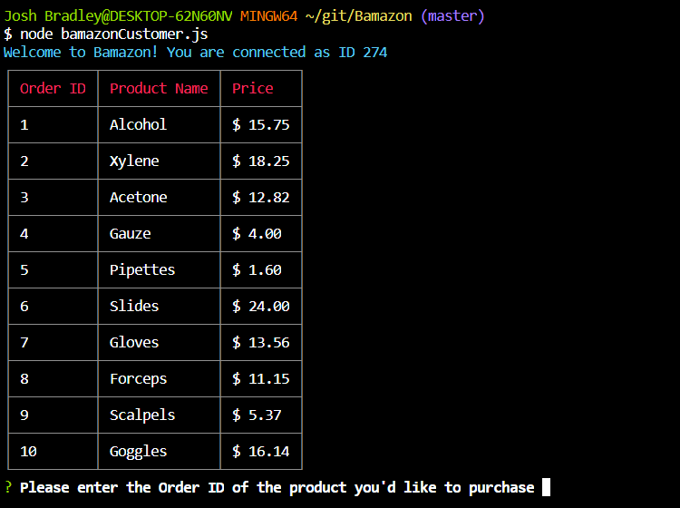
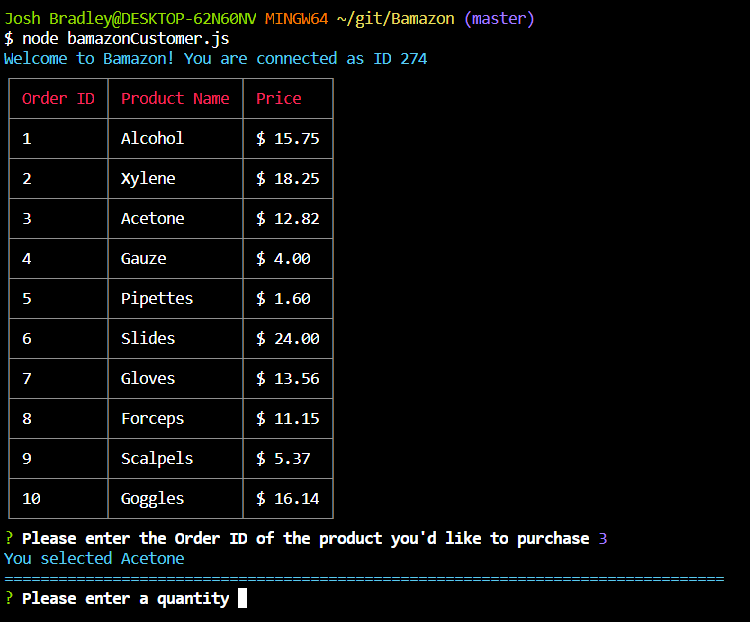
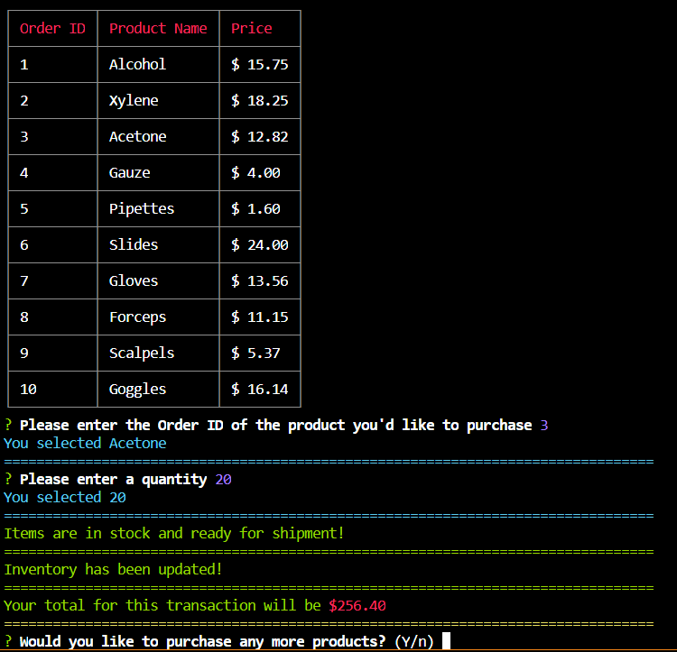
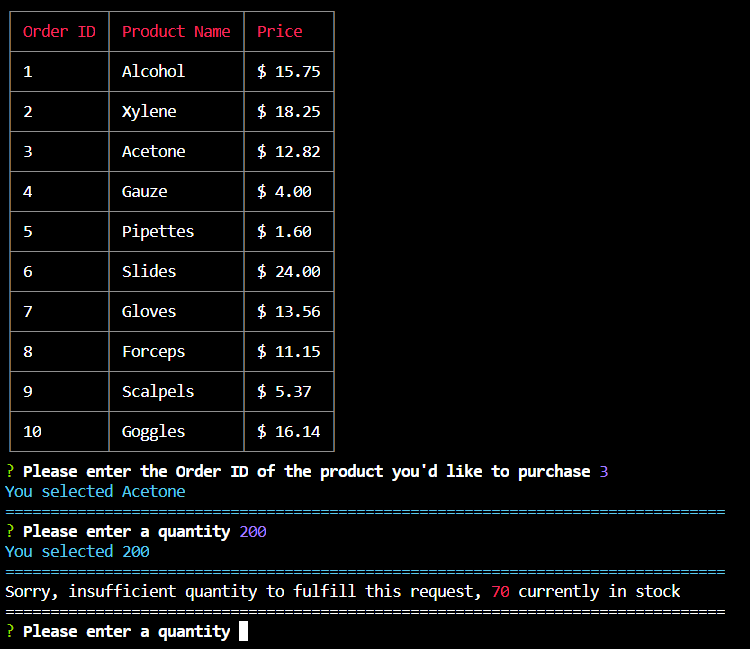
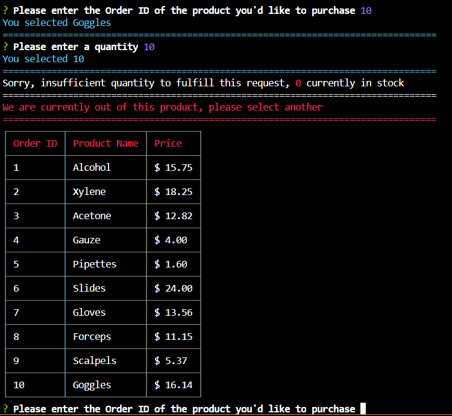
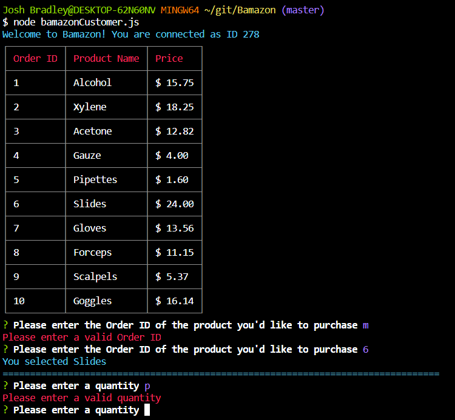
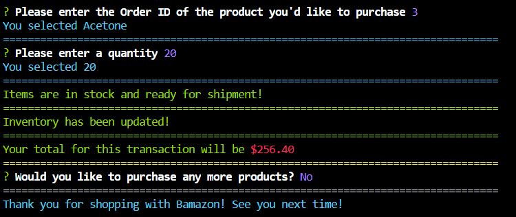
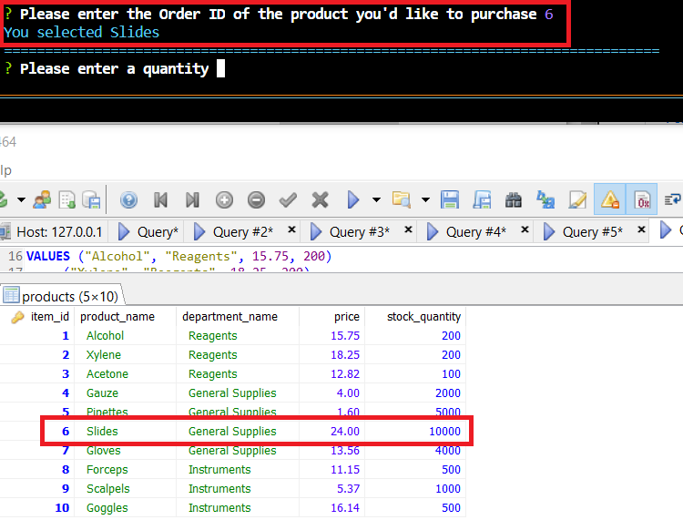
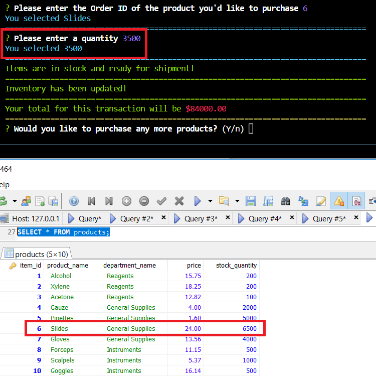

# Bamazon
Bamazon is a command line "store-front" that takes in product orders from the user and updates stock inventory accordingly. Users are provided a total for their purchases, as well as the stock levels when there is insufficient quantity to fulfill their requests.

## Command Line Input
The command line requires a specific input to execute properly
```
node customerBamazon.js
```

## Instructions
At the start of the application, a table will display the available **Products**, the **Order ID**, and the **Price** for each. The user will then be prompted to enter the Order ID of the product they wish to purchase, followed by the desired quantity. If there is sufficient inventory, the user will be given a total for their purchase and asked if they wish to order anything else. If stock levels are below the requested quantity, the user will be provided with the current stock and asked to enter another quantity. If the current stock is depleted, the user will be notified and given the products table in order to make another selection. The application can be closed after finalizing a purchase by selecting "n" when prompted to make another purchase.

## Resources
The application was created with **Node.js** and **MySQL** utilizing the following package installs:

**mysql**
```
npm i mysql
```
Connecting and utilizing MySQL database

**inquirer**
```
npm i inquirer
```
Command line interface for prompting user input

**chalk**
```
npm i chalk
```
Decorating command line

**cli-table**
```
npm i cli-table2
```
Creating decorative table for displaying products

## Demo
Screenshots demonstrating functionality

**Product Table**


**Order ID and Quantity Prompt**


**Successful Order**


**Low Stock**


**No Stock**


**Invalid Input**


**End Order**


**Database Preorder**


**Database Postorder**

